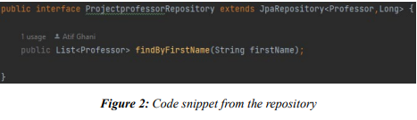
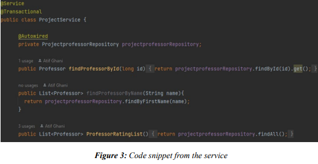
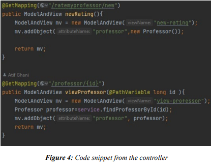
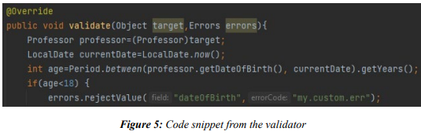
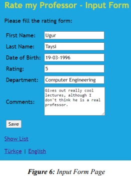
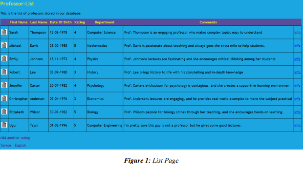
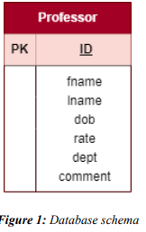
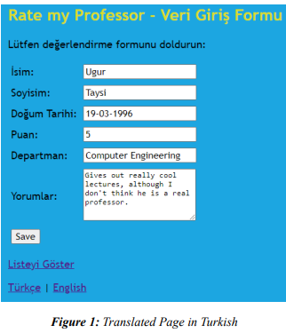

# RateMyProfessor

The Spring Boot application we have implemented is a web application that allows users to view and
rate university professors. The main entities involved in the application are Professors, who have several
properties including name, birth date, rating, department, and additional comments.

Below we will break down the different components of our application:

## Model:

The Professor class in the model package represents the domain object. The Professor class is annotated
with @Entity, meaning that it's mapped to our database table, in this case, a table named "professor".
Each instance of Professor represents a row in the table. The class has fields for id, firstName, lastName,
dateOfBirth, rating, department, and comments, each representing a column in the table.

## Repository:

The ProjectprofessorRepository interface in the dao package extends JpaRepository which provides
various methods out of the box for querying the database. The generic types in
JpaRepository<Professor,Long> signify that this repository is for the Professor entity and the type of
its primary key is Long.

## Service:

The ProjectService class in the service package contains the business logic of the application. It uses
the ProjectprofessorRepository to query the database and perform operations such as finding a professor
by ID or name, listing all professors, saving a professor's rating, and deleting a professor.

## Controller:

The ProjectController class in the controller package is responsible for handling user requests and
returning responses. It has various methods annotated with @GetMapping or @PostMapping, each of
which corresponds to a specific URL path. These methods call the appropriate service methods, put the
results into a ModelAndView, and return it. The ModelAndView contains the data to be displayed (the
model) and the name of the view (e.g., an HTML file) to render the data.

## Validator:

The RateprofessorValidator class in the validator package validates the Professor object in the
addRating method of the controller. If there are validation errors, the user is shown the form again with
error messages. For example, there is a custom validation provided for the data of birth of the professor,
if they are less than 18 years old an error will be given. 

## Templates:

The templates directory contains Thymeleaf HTML templates which are used to render the data. These
templates are referred to by name in the controllers. The templates contain placeholders for data that
get replaced with actual values when the templates are rendered.

## SQL Files:

The schema.sql and data.sql files in the sql directory are used to create the necessary database table and
populate it with initial data, respectively. The schema.sql file contains a SQL CREATE TABLE
statement to create the "professor" table, and the data.sql file contains several SQL INSERT INTO
statements to insert data into the table.

## Internationalization:

The website supports internationalization, where users can switch between languages using the
language switching buttons at the bottom of each page and the contents will be shown translated based
on selection. 

## Conclusion:

Overall, the application follows the Model-View-Controller (MVC) architectural pattern. It uses the
Spring Framework's support for developing web applications and for integrating with a relational
database using Spring Data JPA.

