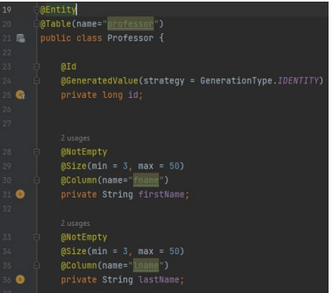

# RateMyProfessor

The Spring Boot application we have implemented is a web application that allows users to view and
rate university professors. The main entities involved in the application are Professors, who have several
properties including name, birth date, rating, department, and additional comments.

Below we will break down the different components of our application:

## Model:

The Professor class in the model package represents the domain object. The Professor class is annotated
with @Entity, meaning that it's mapped to our database table, in this case, a table named "professor".
Each instance of Professor represents a row in the table. The class has fields for id, firstName, lastName,
dateOfBirth, rating, department, and comments, each representing a column in the table.

